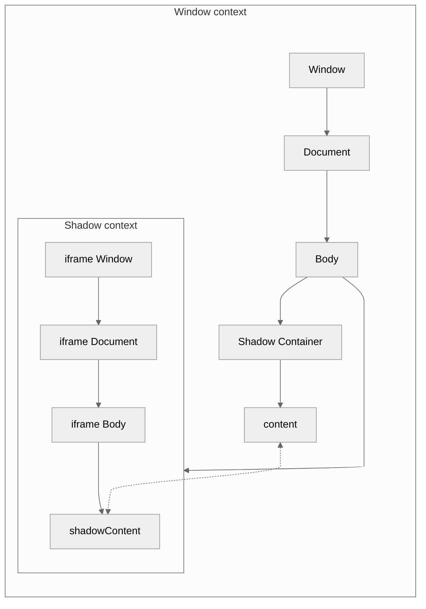

# ShadowJs

This is a proof of concept for JavaScript encapsulation similar to [Shadow DOM](https://developer.mozilla.org/en-US/docs/Web/Web_Components/Using_shadow_DOM) by rendering a hidden `<iframe>` with a separated `window` context. This is useful if you want to load some third-party JavaScript that pollutes the global scope or interferes with another instance of a shared library.

However `<iframe>`s behave different from other DOM elements and make for bad overlays - although you can make their background transparent, they don't passthrough clicks or bubble up events. That's why the `<iframe>` body has to be cloned back into the actual DOM to make changes visible, and all events originating these DOM nodes have to be passed to their corresponding node in the `<iframe>`.

**A simple illustration of an example DOM using ShadowJs to link the** `content` **and** `shadowContent` **nodes:**



## Usage

The ShadowJs package exposes a single function that can be used in two ways and asynchronously returns an object of the `ShadowJs` class to access the shadow context and add listeners.

### As a copy of a static HTML element

The easiest way is to wrap the elements you want to clone into the `<iframe>` and pass it:

```html
<div id="shadow-container">
  <p>text to change</p>
</div>
```

```javascript
import { shadowJs } from "shadow-js";
shadowJs(document.querySelector("#shadow-container"));
```

### Dynamically generated using JS

Alternatively you can pass a render function that builds the HTML element to render in the shadow as the second parameter. This function cannot reference outside elements, as it is `eval`ed in the shadow context. For example:

```html
<div id="shadow-container"></div>
```

```javascript
import { shadowJs } from "shadow-js";

function renderFn() {
  const elem = document.createElement("p");
  elem.textContent = "rendered text to change";
  return elem;
}

shadowJs(document.querySelector("#shadow-container"), renderFn);
```

### The `ShadowJs` class

- `registerWindowFunction`: Copy a function to the shadow context. Similiar to the render function, the function is `eval`ed in the shadow context and can only reference elements existing in the shadow. You can also register functions by accessing the `contentWindow` of the `<iframe>`, as it is exposed as `shadow`.
- `getWindowProperty`: This is a shortcut to access values in the shadow context - however you can access the `contentWindow` of the `<iframe>` yourself, as it is exposed as `shadow`.
- `onUpdateShadow`: You can add a listener with to run your code every time the nodes are cloned from the shadow to the actual DOM - so every time you call or add a function inside the shadow (or `updateElementFromShadow` is called without explicitly skipping listeners).
- `updateElementFromShadow`: This can be hooked into third party libraries that manipulate the shadow content to copy all changes to the target element.<br>
  **NOTE:** Do not call `updateElementFromShadow` from a listener added with `onUpdateShadow` as this will result in an infinite loop. If you do need to, use the parameter `false` to skip listener execution.

## Try it out

The `test` directory can be built and run to display two simple use cases in the browser. Their source code is also a good starting point to build your own test case.

## When should I use this?

Hopefully, **not at all**. This is only a workaround if you have no control over a third party JavaScript that breaks your own code.

---

Run `git config --add include.path ../.gitconfig` to include the template config in your project config.
